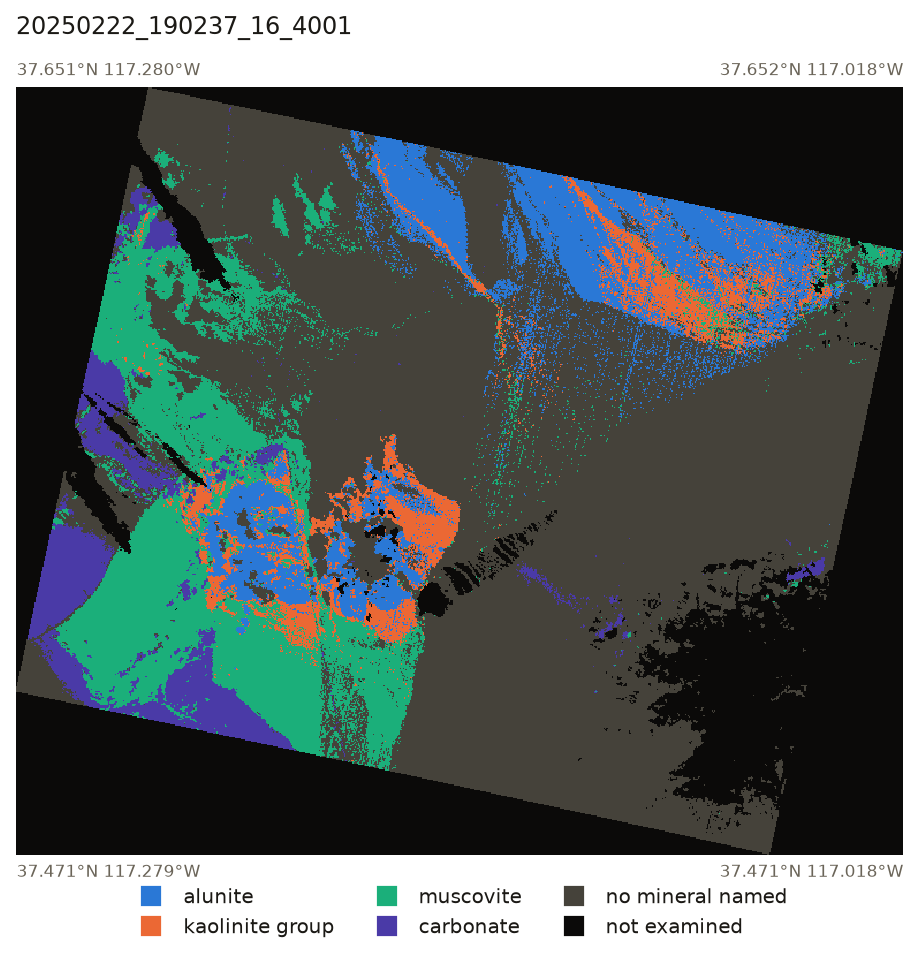
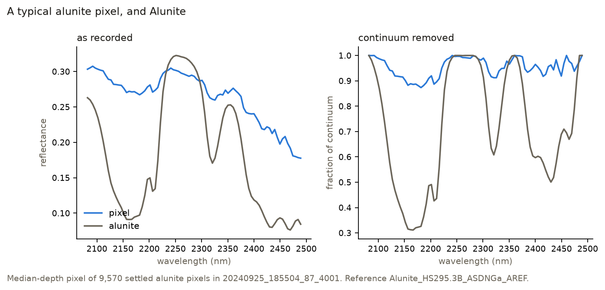
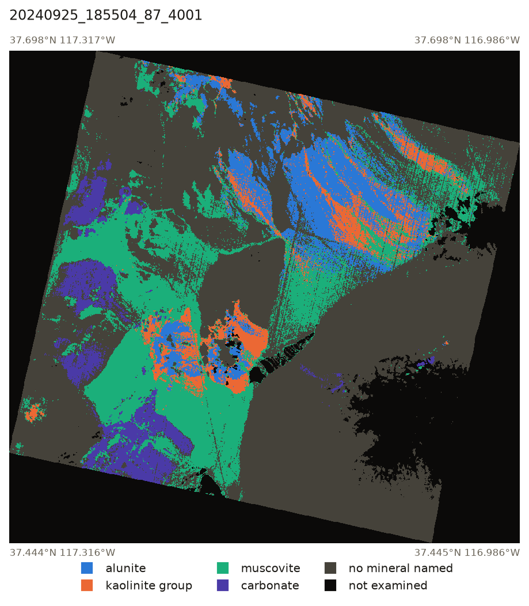
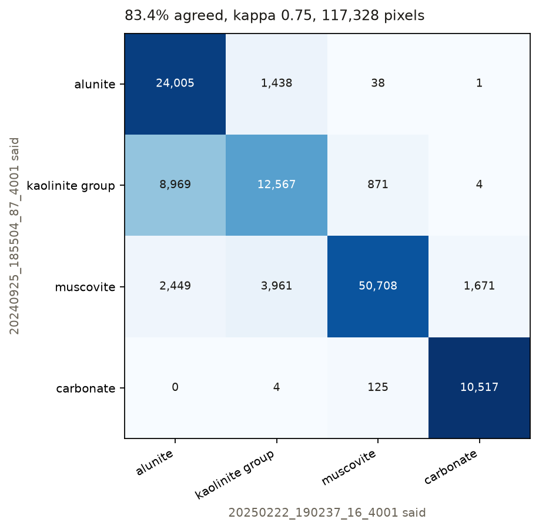
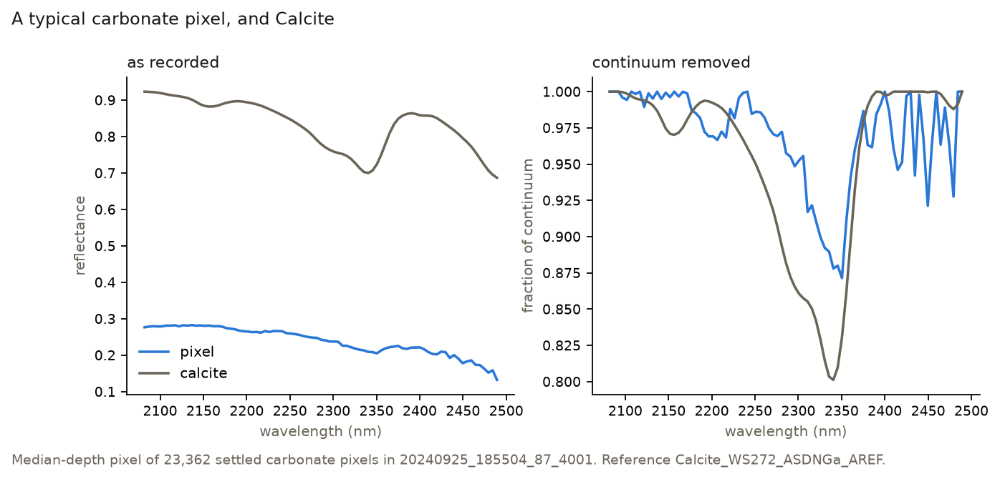

# Mineral Mapping from Tanager-1 at Cuprite, Nevada

## Overview

This report details a pipeline for mapping minerals at Cuprite, Nevada, using Tanager-1 satellite data. Tanager-1 measures reflected light across 426 wavelengths per pixel. By matching these spectra against the USGS Spectral Library, the pipeline identifies ground mineralogy based on characteristic light absorption.

The Cuprite site was selected due to its well-documented mineralogy, allowing for effective error detection. Analysis was performed on two scenes acquired five months apart to validate the consistency of the findings.

Grey is ground that was examined and could not be identified; black is ground excluded before matching. Of 331,279 pixels examined, 126,200 were assigned a mineral and 70,111 of those had a ranking noise could not have reversed.

## Methodology

* **Masking:** Excludes pixels flagged for cloud, cirrus, or no-data, as well as those with a Normalized Difference Vegetation Index (NDVI) > 0.2 or shortwave reflectance < 0.05. Approximately 65% of a scene remains after masking.
* **Resampling:** Laboratory reference spectra (2151 wavelengths) are averaged onto the Tanager-1 bands using a Gaussian response based on each band's measured full width at half maximum.
* **Continuum Removal:** Overall brightness and slope are removed by dividing each spectrum by its upper convex hull. This isolates the true pattern of absorptions.
* **Matching:** Pixels are compared to reference spectra based on the   angle between their continuum-removed shapes over the 2080–2490 nm range.
* **Rejection Criteria:** To distinguish real matches from noise, a pixel must exceed a noise-derived apparent absorption depth of 0.063 and match a reference within an angle of 38.8°. Pixels are classified as "settled" only if the margin between the first and second best matches exceeds expected noise variance.

Continuum removal in practice. On the left, as recorded: the laboratory sample is a pure powder and the pixel covers 900 m² of mixed ground, so they differ threefold in reflectance. On the right, with brightness divided out: the pixel's absorptions are about five times shallower but fall at the same wavelengths.

## Mineral Classification Set

The pipeline maps six distinct classes based on empirical measurement:

1. **Alunite**
2. **Kaolinite Group:** (Kaolinite, dickite, and halloysite). Grouped together because distinguishing them exceeds the sensor's precision.
3. **Muscovite**
4. **Pyrophyllite:** Retained for measurement accuracy despite identifying almost no pixels.
5. **Carbonate**
6. **Dry Vegetation:** Included strictly to prevent false positives. Before its addition, dry vegetation falsely accounted for 58% of carbonate pixel assignments.

## Repeat-Pass Agreement

Two scenes covering a shared 106 km² area were mapped independently to assess stability.

The September 2024 scene, mapped independently of the February 2025 scene shown above. It covers a wider area, with the February scene contained inside it. The two were acquired from different passes at different sun and view angles, and share a 30 m grid exactly, so they are compared pixel to pixel without resampling.

* **Overall Agreement:** 83.4% of pixels were assigned the same mineral group across both passes (Cohen's kappa 0.75).
* **High-Confidence Agreement:** When restricted to pixels where both maps achieved a settled, confident ranking, agreement rose to **98.0%**.
* **Illumination Variance:** Disagreements were largely directional (e.g., boundaries between alunite and kaolinite shifted with seasonal illumination changes between September and February).

Every combination of the two maps' assignments. The diagonal is agreement. The directional bias is visible off it: 8,969 pixels move from the kaolinite group to alunite between September and February, against 1,438 moving back.

Agreement measures stability rather than accuracy. Carbonate is the most stable class at 98.8%, and is also the class with the weakest supporting evidence, since dry vegetation persists between seasons as reliably as carbonate does.

## Known Limitations

* **Family, not specific mineral:** The map identifies which family a mineral belongs to, not which member of it. Kaolinite, dickite and halloysite all absorb at the same wavelength on these bands, so they are reported as one class.
* **Reference Resolution Limitations:** Buddingtonite was excluded because available lab spectra were too coarse (26.6 nm) compared to Tanager-1's 5.2–5.5 nm bands.
* **Sensor Resolution Discrepancy:** Tanager-1's bands are slightly finer than the finest USGS laboratory spectra (5.6 nm), meaning the library references are marginally smoother than true sensor measurements.
* **Carbonate Uncertainty:** Carbonate identifications remain slightly uncertain due to broad, asymmetric absorptions and residual overlap with dry vegetation signatures.

Compare this with the alunite figure above. The pixel's absorption is broad and lopsided where calcite's is narrow and centred, and its second-choice match is dry vegetation in 92% of carbonate pixels.

* **Validation:** No comparison against an independent published map has been made. All validation reported here is internal consistency.
